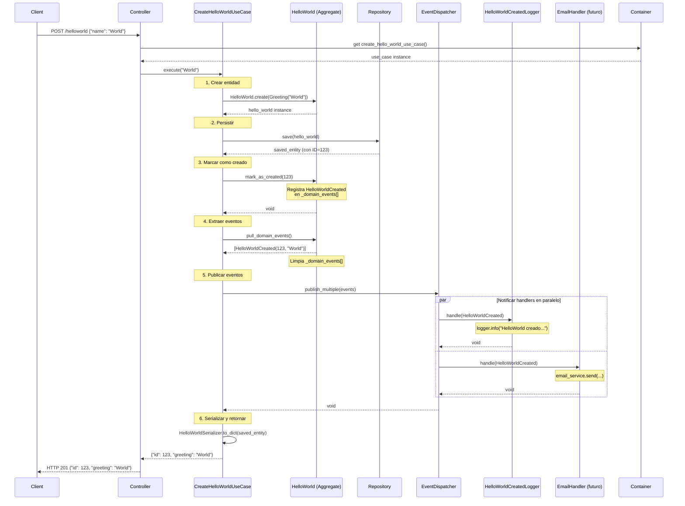
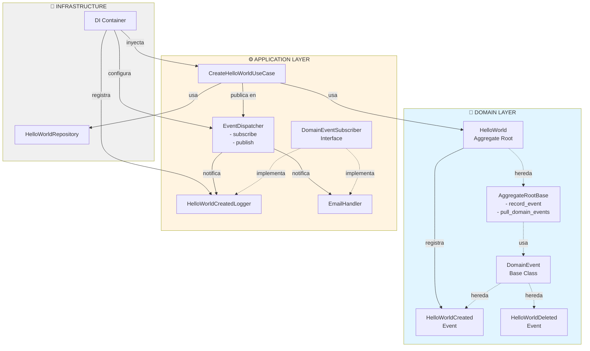
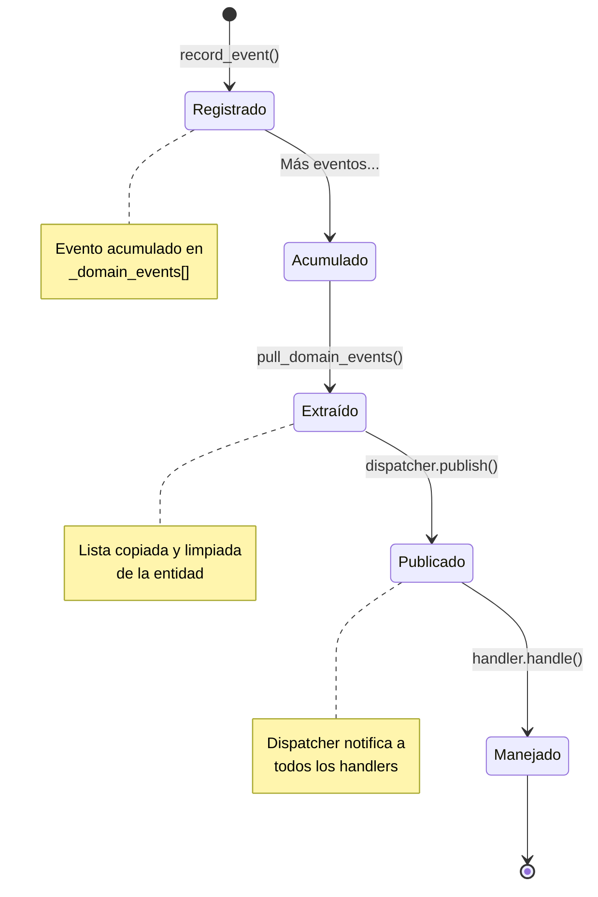
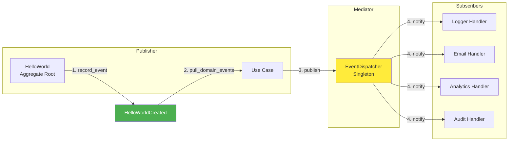
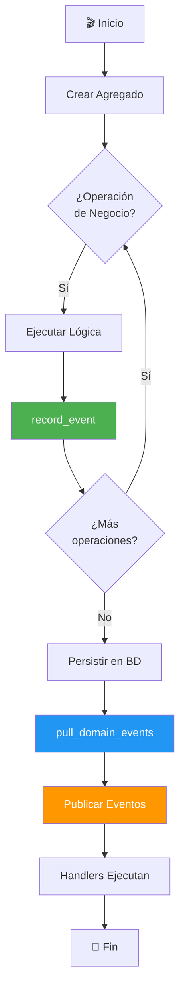
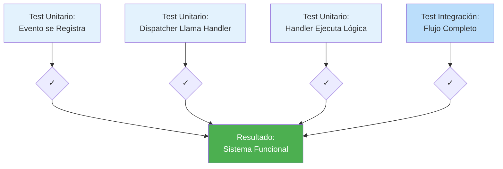
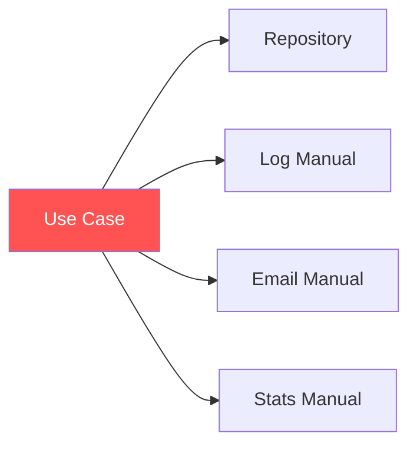
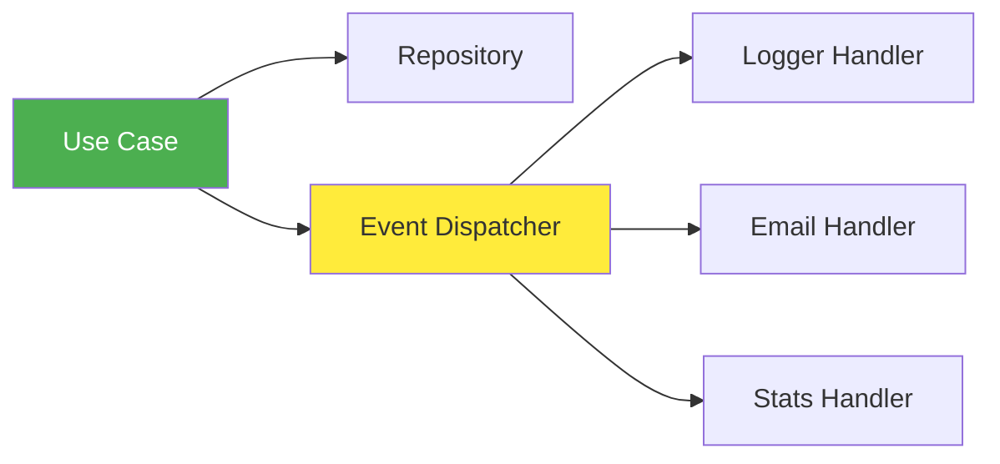

# Diagrama de Flujo - Sistema de Eventos de Dominio

## 🔄 Flujo Completo: Crear HelloWorld con Eventos



## 🏗️ Arquitectura de Componentes



## 📊 Estados de un Evento



## 🎭 Patrón Observer/Pub-Sub



## 🔀 Ciclo de Vida de un Agregado con Eventos



## 📦 Estructura de Archivos con Eventos

```
app/
├── Shared/
│   ├── Domain/
│   │   ├── Events/
│   │   │   ├── DomainEvent.py              ← Base para eventos
│   │   │   └── DomainEventSubscriber.py    ← Interface handler
│   │   └── Entities/
│   │       └── EntityBase.py               ← AggregateRootBase
│   └── Infrastructure/
│       └── Events/
│           └── EventDispatcher.py          ← Despachador
│
├── Domain/
│   └── HelloWorld/
│       ├── Events/
│       │   ├── HelloWorldCreated.py        ← Evento específico
│       │   └── HelloWorldDeleted.py        ← Evento específico
│       └── HelloWorld.py                   ← Aggregate Root
│
├── Application/
│   ├── EventHandlers/
│   │   ├── HelloWorldCreatedLogger.py      ← Handler
│   │   └── HelloWorldDeletedLogger.py      ← Handler
│   └── UseCases/
│       └── HelloWorld/
│           ├── CreateHelloWorldUseCase.py  ← Publica eventos
│           └── DeleteHelloWorldUseCase.py  ← Publica eventos
│
└── config/
    └── container.py                        ← Registra handlers
```

## 🧪 Testing - Flujo de Verificación



## ⚡ Comparación: Sin Eventos vs Con Eventos

### Sin Eventos (Antes) ❌



**Problemas:**
- Alto acoplamiento
- Use Case con muchas responsabilidades
- Difícil de testear
- No extensible

### Con Eventos (Después) ✅



**Beneficios:**
- Bajo acoplamiento
- Use Case enfocado
- Fácil de testear
- Altamente extensible

---

## 📌 Conceptos Clave Visualizados

### 1. Evento = Pasado

```
❌ INCORRECTO          ✅ CORRECTO
CreateHelloWorld  →   HelloWorldCreated
DeleteHelloWorld  →   HelloWorldDeleted
UpdateHelloWorld  →   HelloWorldUpdated
```

### 2. Handler = Reacción

```
Evento               →    Handler
HelloWorldCreated    →    Logger escribe en archivo
                     →    Email envía notificación
                     →    Analytics incrementa contador
                     →    Audit guarda en EventStore
```

### 3. Dispatcher = Mediador

```
Publisher             Mediator              Subscribers
   │                     │                      │
   ├─────publish────────▶│                      │
   │                     ├───────notify────────▶│ Handler 1
   │                     ├───────notify────────▶│ Handler 2
   │                     └───────notify────────▶│ Handler 3
```

---

**Este diagrama visual complementa la documentación completa en `DOMAIN_EVENTS_DOCUMENTATION.md`**
